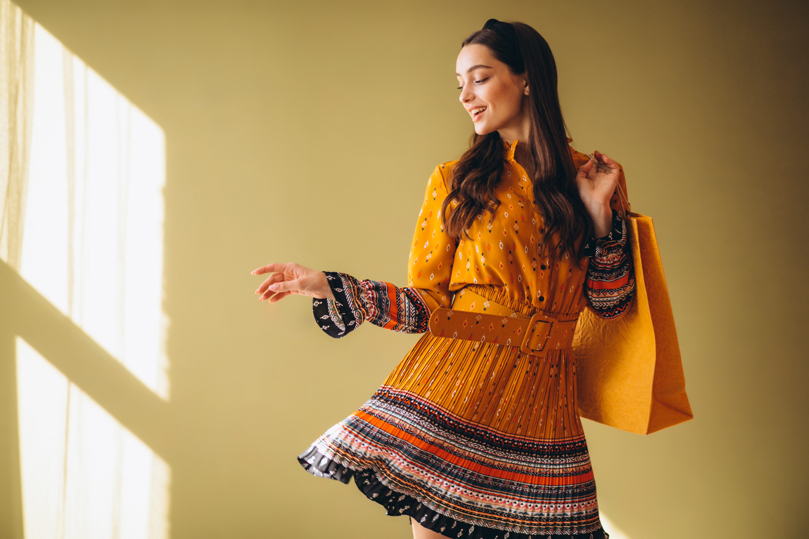

## The Rise of Modern Vintage

> Modern vintage isn’t about nostalgia — it’s about intention.  
> It’s a response to excess, speed, and disposability in fashion.

Fashion has always been cyclical, but something fundamental has shifted. Vintage today is no longer driven only by affordability or nostalgia — it has evolved into a deliberate, design-led movement.

Modern vintage sits at the intersection of past craftsmanship and contemporary styling. It reshapes how we think about sustainability, identity, and long-term value.

For a generation exhausted by fast fashion and disposable trends, vintage offers something slower — and more meaningful.

### A Shift From Consumption to Choice

Modern vintage encourages restraint.  
Not less style — but *better decisions*.

It asks you to pause, to notice construction, fabric, history. To build a wardrobe with purpose instead of impulse.

---

## What “Modern Vintage” Really Means

Modern vintage is not about dressing like another era.  
It’s about reinterpretation.

### Recontextual, Not Retro

A structured 90s blazer, refined with modern tailoring.  
A hand-embroidered kurta paired with clean, minimalist silhouettes.  
A thrifted leather jacket layered over contemporary essentials.

Modern vintage values:
- Quality over quantity  
- Story over trend  
- Longevity over disposability  

Clothing becomes cultural artifact — not temporary content.

---

## Editorial Thrift vs Fast Fashion

Fast fashion is built on speed.  
Editorial thrift is built on thought.

### Two Opposing Systems

**Fast fashion**
- Prioritizes volume and virality  
- Relies heavily on synthetic materials  
- Encourages constant replacement  

**Editorial thrift**
- Focuses on timeless silhouettes  
- Celebrates wear, patina, and history  
- Encourages personal styling over mass trends  

When thrift is approached editorially, it stops being random.  
It becomes curated, expressive, and elevated.

*Layered vintage pieces styled with intention — proof that pre-loved can feel contemporary.*

---

## Why Sustainability Needs Aesthetics

Sustainable fashion failed for years because it was framed as sacrifice.

Buy this because it’s better.  
Wear this because it’s responsible.

But people don’t build wardrobes out of guilt.  
They build them out of desire.

### Beauty Is the Gateway

Aesthetics are not the enemy of sustainability — they are the entry point.

Modern vintage succeeds because it:
- Looks intentional, not compromised  
- Feels expressive, not restrictive  
- Aligns ethics with beauty  

When sustainability looks good, it stops being a niche choice.

---

## The Emotional Value of Pre-Loved Fashion

There’s something deeply human about wearing clothes that have lived before you.

A softened collar.  
Fabric that drapes better with age.  
Stitching that reflects craftsmanship instead of speed.

Pre-loved fashion carries memory — even when the story is unknown.  
That emotional depth cannot be mass-produced.

---

## Styling Modern Vintage Today

Modern vintage works best when balance leads the styling.

### Editorial Rules to Follow

- Anchor vintage pieces with clean modern basics  
- Let one statement item define the look  
- Avoid costume styling — context matters  
- Tailoring elevates everything  

The goal is effortlessness, not reenactment.

---

## Thrift as a Form of Curation

Great thrift style is never accidental.

### The Editor’s Mindset

Editorial thrift mirrors fashion editing:
- Saying no more than yes  
- Choosing pieces with intention  
- Building a coherent visual narrative  

This approach transforms thrifting from shopping into curation.

---

## The Future Is Already Here

Modern vintage isn’t waiting for relevance.  
It already has it.

As conversations around waste, overproduction, and responsibility grow, rewearing and reimagining will only become more central to personal style.

The future of fashion isn’t only innovation.  
It’s discernment.

---

## Final Thoughts

Modern vintage asks a simple question:

**What if the most stylish choice isn’t something new — but something chosen well?**

By rethinking how we shop, rewearing what already exists, and repeating intentional choices, we move toward a fashion culture built on meaning, not momentum.

Style isn’t about having more.  
It’s about knowing what’s worth keeping.
